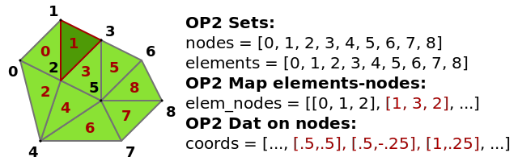
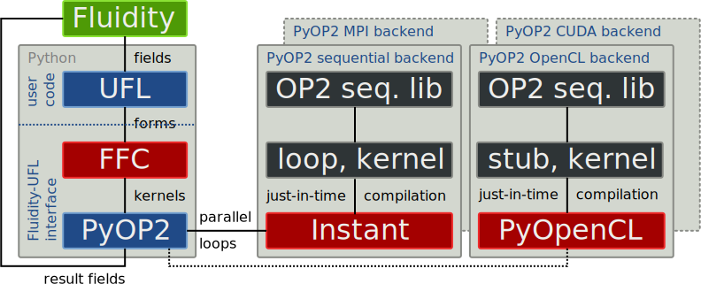

# PyOP2: A High-Level Framework for Performance-Portable Simulations on Unstructured Meshes

!SLIDE left title

# PyOP2: A High-Level Framework for Performance-Portable Simulations on Unstructured Meshes

## Florian Rathgeber1, Graham Markall1, Lawrence Mitchell3, Nicolas Loriant1, David Ham1,2, Carlo Bertolli1, Paul Kelly1

### 1 Department of Computing
### 2 Grantham Institute for Climate Change
### Imperial College London
### 3 EPCC, University of Edinburgh

!NOTES

Thank you Ram for the kind introduction and thanks to all of you for making it
here so early. Good morning and welcome, my name is Florian from Imperial
College London. I would like to present to you today work I've done with a
number of collaborators on the PyOP2 framework for parallel computations on
unstructured meshes and specifically how we use PyOP2 to deliver
performance-portable finite-element simulations and get them in the hand of
domain specialists.

!SLIDE left

# Computational science is hard

## Radical paradigm shifts in CSE due to many-core computing
* Scientists have to rewrite and hand-tune scientific codes for each newly emerging platform
* Barrier: inhibits efficient utilisation of state-of-the-art computational resources

## Generative (meta)programming is the solution
* Generate platform-specific implementations from a common source instead of hand-coding them
* Tailor to characteristics of the hardware and problem

!NOTES

Many of you I assume are computational scientists and will have experienced
the radical paradigm shift many-core architectures have brought to the field
and the challenges we face trying to make efficient use of them. Computational
science is hard, scientific codes are complex and having to rewrite and
hand-tune them for a new platform is a daunting, tedious and error-prone task.
Porting takes a lot of resources and is therefore not always feasible even if
desired. This creates a significant barrier when it comes to efficient
utilisation of state-of-the-art computational resources as we see them
deployed more and more widely. If not overcome, this barrier will inhibit
progress in computational science in the years to come.

Fortunately there is a solution to overcoming this challenge, which is
generative metaprogramming. By that we mean automatically generating a variety
of platform-specific implementations from a single common source.  Ideally
this specification is at a much higher level of abstraction than the low-level
implementation to be generated. Generating code at runtime we can not only
tailor to the characteristics of the hardware we want to run on but also the
problem we want to solve.

!SLIDE huge

# The challenge

> How do we get performance-portable finite element solvers that are
efficient, generic and easy to use in the hands of domain scientists?

!NOTES

The specific challenge I want to address today is performance-portability for the
finite element method. What we really want to do is get efficient, generic and
easy-to-use finite element solvers in the hands of domain scientists.

You'll notice that I use generality and efficiency in the same sentence. These
are goals that are usually seen as conflicting, but the strategies and tools I
am going to show you now allow us to attain both of these conflicting goals at
the same time.

!SLIDE left

# The strategy

## Get the abstractions right
... to isolate numerical methods from their mapping to hardware

## Start at the top, work your way down
... and make decisions at the highest abstraction level possible

## Harness the power of DSLs
... for generative, instead of transformative optimisations

!NOTES

The strategy is building the right set of layered abstractions to isolate
numerical methods from their mapping to hardware.

!SLIDE left

# The tools

## Embedded domain-specific languages

... capture and *efficiently express characteristics* of the application/problem domain

## Runtime code generation

... encapsulates *specialist expertise* to deliver *problem- and platform-specific optimisations*

## Just-in-time (JIT) compilation

... makes *problem-specific* generated code *transparently* available to the application at runtime

!NOTES

## In combination, they

* raise the level of abstraction and incorporate domain-specific knowledge
* decouple problem domains from their efficient implementation on different hardware
* capture design spaces and open optimisation spaces
* enable reuse of code generation and optimisation expertise and tool chains

!SLIDE

# Tool chain overview

!SLIDE

# An expert for each layer

!SLIDE huge

# Higher level abstraction

## From the equation to the finite element implementation

!SLIDE left

# FFC1 takes UFL2 equations

The weak form of the Helmholtz equation

is expressed in UFL as follows:
@@@ python
f = state.scalar_fields["Tracer"]

v = TestFunction(f)
u = TrialFunction(f)

lmbda = 1
a = (dot(grad(v), grad(u)) - lmbda * v * u) * dx

L = v*f*dx

solve(a == L, f)
@@@

1 [FFC](https://launchpad.net/ffc) is the FEniCS Form
Compiler,
2 [UFL](https://launchpad.net/UFL) is the Unified Form Language from the [FEniCS project](https://fenicsproject.org/)

!NOTES

\int_\Omega \nabla v \cdot \nabla u - \lambda v u ~\dx = \int_{\Omega} v f ~\dx

## Fluidity extensions

* **`state.scalar_fields`** interfaces to Fluidity: read/write field of given name
* **`solve`** records equation to be solved and returns `Coefficient` for solution field

!SLIDE left

# ... and generates local assembly kernels

## Helmholtz OP2 kernel
@@@ clike
// A - local tensor to assemble
// x - local coordinates
void kernel(double A[1][1], double *x[2],
            int j, int k) {
  // FE0 - Shape functions
  // Dij - Shape function derivatives
  // Kij - Jacobian inverse / determinant
  // W3  - Quadrature weights
  // det - Jacobian determinant
  for (unsigned int ip = 0; ip < 3; ip++) {
    A[0][0] += (FE0[ip][j] * FE0[ip][k] * (-1.0)
      + (((K00 * D10[ip][j] + K10 * D01[ip][j]))
        *((K00 * D10[ip][k] + K10 * D01[ip][k]))
      + ((K01 * D10[ip][j] + K11 * D01[ip][j]))
        *((K01 * D10[ip][k] + K11 * D01[ip][k]))
      )) * W3[ip] * det;
  }
}
@@@

!SLIDE huge

# Lower level abstraction

## From the finite element implementation to its efficient parallel execution

!SLIDE left

# PyOP2 – a high-level framework for unstructured mesh computations

## Abstractions for unstructured meshes

* **Sets** of entities (e.g. nodes, edges, faces)
* **Mappings** between sets (e.g. from edges to nodes)
* **Datasets** holding data on a set (e.g. fields in finite-element terms)

!SLIDE left

# Parallel computations on mesh entities in PyOP2

## Mesh computations as parallel loops

* execute a *kernel* for all members of an iteration set in arbitrary order
* datasets accessed through at most one level of indirection via a mapping
* *access descriptors* specify which data is passed to the kernel and how it is addressed

## Multiple hardware backends via *runtime code generation*

* partioning/colouring for efficient scheduling and execution on different hardware
* currently supports CUDA/OpenCL, MPI in development, AVX support planned

!SLIDE left

# PyOP2 for FE computations

## Finite element local assembly
... means computing the *same kernel* for *every* mesh entity (cell, facet): a perfect match for the PyOP2 abstraction

## PyOP2 abstracts away data marshaling and parallel execution
* controls whether/how/when a matrix is assembled
* local assembly kernel is *translated* for and *efficiently executed* on the target architecture

## Global asssembly and linear algebra
... implemented as a thin wrapper on top of backend-specific linear algebra packages: *PETSc4py* on the CPU, *Cusp* on the GPU

!SLIDE left

# Finite element assembly and solve in PyOP2

@@@ python
from pyop2 import op2, ffc_interface

def solve(equation, x):
    # Generate kernels for matrix and rhs assembly
    mass = ffc_interface.compile_form(equation.lhs, "mass")[0]
    rhs  = ffc_interface.compile_form(equation.rhs, "rhs")[0]

    # Extract coordinates (coords) and forcing function (f_vals)

    # Construct OP2 matrix to assemble into
    sparsity = op2.Sparsity((elem_node, elem_node), sparsity_dim) 
    mat = op2.Mat(sparsity, numpy.float64)
    f = op2.Dat(nodes, 1, f_vals, numpy.float64)

    # Assemble lhs, rhs and solve linear system
    op2.par_loop(mass, elements(3,3),
             mat((elem_node[op2.i[0]], elem_node[op2.i[1]]), op2.INC),
             coords(elem_node, op2.READ))

    op2.par_loop(rhs, elements(3),
             b(elem_node[op2.i[0]], op2.INC),
             coords(elem_node, op2.READ),
             f(elem_node, op2.READ))

    op2.solve(mat, x, b)
@@@

!SLIDE left

# Interfacing PyOP2 to Fluidity

## Fluidity

* open source, general purpose, multi-phase computational fluid dynamics code with large international userbase
* developed at [AMCG](https://www.imperial.ac.uk/earth-science/research/research-groups/amcg/) at Imperial College
* XML-based configuration files with GUI editor
* existing interface to access fields from Python

## Interfacing PyOP2
* additional equation type *UFL* alongside Fluidity's built-in equations, where user provides custom UFL code
* call PyOP2 instead of Fluidity's built-in advection-diffusion solver
* create PyOP2 data structures for accessed fields on the fly

!SLIDE left

# UFL equations in Fluidity

## For each UFL equation in each time step:

* Shell out to Python, execute the user's UFL equation
* FFC generates C++ code for local assembly of FE forms
* Instant JIT-compiles kernels and the parallel loops invoking them

!NOTES
* FFC + Instant invocations are cached

!SLIDE left

# Preliminary benchmarks

Measure total time to solution for 100 time steps of an advection-diffusion
test case; matrix/vector re-assembled every time step. 

### Solver
CG with Jacobi preconditioning using PETSc 3.3 (PyOP2), 3.2 (DOLFIN)

### Host machine
2x Intel Xeon E5650 Westmere 6-core (HT off), 48GB RAM

### GPU
NVIDIA GeForce GTX680 (Kepler)

### Mesh
2D unit square meshed with triangles (200 - 204800 elements)

### Dolfin
Revision 7122, Tensor representation, CPP optimisations on

!SLIDE

}}} images/seq_runtime_linear.svg

!SLIDE

}}} images/seq_speedup_linear.svg

!SLIDE

}}} images/cuda_runtime_linear.svg

!SLIDE

}}} images/cuda_speedup_linear.svg

!SLIDE left

# Conclusions & future work

## Conclusions
* Designed two-layer abstraction for FEM computation from high-level sources
* Runtime code generation and just-in-time compilation provide performance portability for multiple backends
* Demonstrated usability and performance through integration with CFD-code Fluidity

## Future Work
* MPI support (already available in OP2)
* Tune OpenCL backend, add AVX backend
* Auto-tuning 

!SLIDE left

# Resources

* All the code is open source on *GitHub* and *Launchpad*. Try it!
* We're looking for contributors and collaborators
* Email: <f.rathgeber@imperial.ac.uk>

### PyOP2
<https://github.com/OP2/PyOP2>

### FFC
<https://code.launchpad.net/~mapdes/ffc/pyop2>

### Fluidity
<https://code.launchpad.net/~fluidity-core/fluidity/pyop2>

### Benchmarks
<https://github.com/OP2/PyOP2_benchmarks>

### This talk
<http://kynan.github.com/wolfhpc2012>
